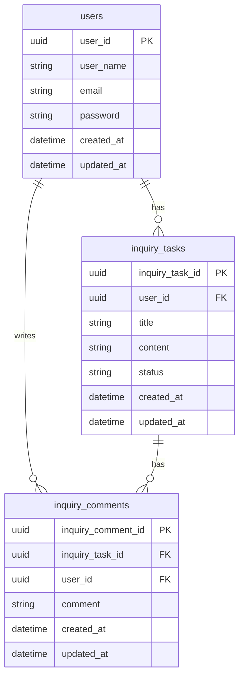

# 概要

本ポートフォリオは、業務で開発している分析アプリケーションのバックエンド設計をもとに、ドメイン駆動設計（DDD設計）の設計思想を整理・再現したものです。実際の業務システムでは、複雑な業務ルールやデータ連携が存在しますが、それらを公開することができないため、本リポジトリでは「問い合わせ管理」というシンプルなドメインに置き換え、ドメイン駆動の設計方針・責務分離・実装パターンが伝わる形で再構築しています。そのため、機能自体はシンプルですが、設計思想およびレイヤー構造は実務と同等の粒度で設計しています。フレームワークはLaravelを使用しております。

## ドメイン駆動設計の採用理由

## ビジネスロジックの隔離

**プログラムの都合に依存しないビジネスルールのみをドメイン層に分離・集約するため**にDDD設計を採用しました。分析アプリケーションを構築するにあたり、基盤となるメインシステム固有の仕様や業務ルールを一部吸収する必要があります。しかし、それらを各レイヤーやファイルに分散して実装してしまうと、仕様がコード全体に散在し、変更時の影響範囲が不明確になり、保守性が低下します。そこでドメイン層を設け、メインシステム由来の仕様および分析アプリ固有のビジネスルールを一元的に集約する構成としました。

これにより、以下を実現しています。

- ビジネスロジックの一貫性の担保
- 仕様変更時の影響範囲の限定
- 各レイヤーの責務分離と独立性の確保

また、仕様や独自ルールの把握および制御はドメイン層に閉じ込め、それ以外の層では役割を明確に分離しています。

- UseCase層（Application層）：ユースケース単位で処理の流れを制御
- Presentation層：外部からの入力・出力を担当
- Infrastructure（インフラ層）:外部システムとの連携・接続処理（DB・API等）

このように、業務ロジックと技術的関心事を明確に切り離すことで、長期的な保守性および拡張性の向上を図っています。

## DBに依存しない設計：インターフェースによる「依存性の逆転」

開発初期にDB選定が進行中だったため、具体的な技術基盤に依存せずにロジックを書き進める必要がありました。そこで、**Interface層**を設け、依存性の逆転（DIP）を活用しました。Domain層やApplication層は、具体的なDBの実装（Infrastructure）を見に行くのではなく、Interfaceに対してのみ命令を出します。
これにより、後日DBが変更になっても、**Infrastructure層の実装を差し替えるだけで済み、メインのビジネスロジックには一切修正が及ばない**柔軟性を確保しました。この構成により、初期のDB選定から内容が変わりましたが修正範囲を最小限に抑えることができました。
また複数の外部システム（外部API,S3,Redis,RDB）とアクセスもそれぞれInterface層（RedisInterface,ApiInterface）を別けることにより保守性の高いコードになります。

## バックエンド構成

```sql
[ Controller ]  ← プレゼンテーション層
↓
[ UseCase ]     ← アプリケーション層
↓
[ Domain ]      ← ドメイン層
↑
[ Interface ]　　← インターフェース
↑
[ Infrastructure]  ← インフラ層
↑
[ Database ]
```

| 層 | 役割 | 具体例 | 例 |
| --- | --- | --- | --- |
| Presentation（プレゼンテーション層） | 外部からの入力を受け取り、UseCaseを呼び出し、結果を返す | HTTPリクエスト、バリデーション、DTO変換、レスポンス整形 | Controller、Request、RequestDTO |
| Application（アプリケーション層） | 処理の流れを記述 | UseCase、Domain呼び出し | Usecase |
| Domain（ドメイン層） | 業務ルールを記述 | 業務ルール | Entity、ValueObject、DomainService、Factory |
| Interface（インターフェイス） | 外部アクセスの抽象化 | RepositoryやQueryの型を定義 | RepositoryInterface、QueryInterface |
| Infrastructure（インフラ層） | 外部に接続する処理を記述 | DB接続、SQL、外部API、S3、Redisの接続など | Repository実装、Query実装 |

## 各コンポーネント説明

### プレゼンテーション層

| コンポーネント | 役割 | 具体例 | ポイント |
| --- | --- | --- | --- |
| Controller | リクエストを受け取りUseCaseを呼び出し、レスポンスを返す | UserController | 業務ロジックは書かない、UseCaseを呼ぶ |
| Request | HTTPリクエストを受け取る、入力チェック | GetUserListRequest | バリデーション担当 |
| DTO | 型の生成・型のチェック | GetUserListDto | ・リクエストで変な形式で来た際のバグの早期発見 ・APIレスポンスとして安定した型を保証できる |

## アプリケーション層

| コンポーネント | 役割 | 具体例 | ポイント |
| --- | --- | --- | --- |
| Usecase | 処理の流れを手続き的に記載 | GetUserListUsecase | 呼び出し順序を決める |

### ドメイン層

| コンポーネント | 役割 | 具体例 | ポイント |
| --- | --- | --- | --- |
| Entity | IDを持ち、ライフサイクルを持つ業務オブジェクト | User、Inquiry | 同一性（ID）で識別される |
| ValueObject | 値そのものを表すオブジェクト | UserName、Email | 不変（immutable）、等価性は値で比較 |
| Repository | Entityの取得・保存を行う | InquiryRepository | Domain側にはInterfaceのみ置く |
| Factory | Entityを生成、カプセル化 | InquiryFactory | 生成ロジックが複雑な場合に使用 |
| Query | 集計・検索専用（Entityを返さない） | InquiryQuery | 分析・集計系はRepositoryと分ける |
| DomainService | 業務ロジックを実装 | InquiryService | 複数Entityをまたぐ業務ルール |

## テスト

ドメインに対して単体テストを実装しています。

- src/app/Domain/User/ValueObject/UserPasswordTest.php

パスワードがValueObjectのUserPasswordの定義に準拠しているかテストしています。

正常系：パスワードは8文字以上で大文字小文字あり。

異常系：パスワードは8文字未満や空白が入っている。

- src/app/Domain/User/ValueObject/EmailTest.php

メールがValueObjectのEmailの定義に準拠しているかテストしています。

正常系：Emailの形式に該当する。

異常系：Emailの形式に該当しない、空白など。

## エラーハンドリング

**方針：エラー種別ごとに例外を分離し、責務ごとに扱う**

例外はHandler（src/app/Exceptions/ExceptionHandler）で一元的にレスポンスへ変換する

- **DomainException**（業務ルール違反）
→ ドメイン層で発生し、そのままクライアントに返却
- **ValidationException**（入力不正）
→ リクエスト値の検証エラーとして返却
- **DatabaseOperationException**（DBエラー）
→ ログ出力し、汎用エラーとして返却
- **ResourceNotFoundException**（データ未存在）
→ 404として返却
- **ExternalApiException**（外部APIエラー）
→ ログ出力し、状況に応じてリトライまたはエラー返却

## 今回のGitHubの内容

問い合わせ管理APIを、Laravel + DDD（ドメイン駆動設計）で実装しました。

本システムはシンプルな構成ですが、

- 問い合わせの状態管理（状態遷移）
- コメントによる履歴管理
- 業務ルールに基づく自動ステータス変更

といった「業務ロジック」が存在するため、

それらを適切に分離・表現する目的でDDDを採用しています。

---

## ドメインルール

本システムでは以下の業務ルールを定義しています。

1. 問い合わせ本文は編集せず、コメントとして履歴を追加する

    → 監査性・トレーサビリティの担保

2. 問い合わせの状態は以下の3つで管理する

- OPEN（対応待ち）
- IN_PROGRESS（対応中）
- CLOSED（完了）

3. CLOSED状態でも、ユーザーからコメントが追加された場合は再オープンする

→ 運用上の対応漏れ防止

この「再オープン」のルールは、ドメインロジックとして切り出し、アプリケーション層から直接制御させない設計としています。

---

## 設計のポイント

- ステータス管理は ValueObject（InquiryStatus）として表現
- ステータス変更ロジックは Entity に集約
- 永続化処理は Repository に分離
- トランザクション制御は Infrastructure 層で管理
- UseCaseは「処理の流れ」のみを記述

これにより、**ビジネスルールがインフラやフレームワークに依存しない構造**を実現しています。

---

## DBの設計

・ユーザーテーブル

・問い合わせテーブル

・問い合わせメッセージテーブル



## ユーザーエンドポイント

```
〇ユーザー 一覧取得
【GET】http://localhost:8002/api/users

〇ユーザー詳細取得
【GET】http://localhost:8002/api/users/:userId

〇ユーザー作成
【POST】http://localhost:8002/api/users/new

〇ユーザー更新
【PUT】http://localhost:8002/api/users/:id

〇ユーザー削除
【DELETE】http://localhost:8002/api/users
```

## 問い合わせエンドポイント

```
〇問い合わせ一覧取得
GET:http://localhost:8002/api/inquiries

〇問い合わせ詳細取得
GET:http://localhost:8002/api/inquiries/:inquiryTaskId

〇問い合わせ作成
POST:http://localhost:8002/api/inquiries/new

〇問い合わせコメント作成
POST:http://localhost:8002/api/inquiries/:inquiryTaskId/comments

〇問い合わせステータス更新
PUT:http://localhost:8002/api/inquiries/:inquiryTaskId
```

※ 上記エンドポイントはローカル開発環境の例です。

## まとめ

本ポートフォリオでは、業務で培った設計思想をもとに、DDD（ドメイン駆動設計）を用いたバックエンドAPIの設計および実装を行いました。シンプルなドメインではありますが、

- 業務ルールの明確化
- 責務の分離
- 変更に強い構造

を意識し、実務で通用する形で構築しています。ドメイン駆動設計は特定の言語やフレームワークに依存しない設計思想であるため、本設計は他の技術スタックにおいても再現可能です。最後までご覧いただきありがとうございました。
